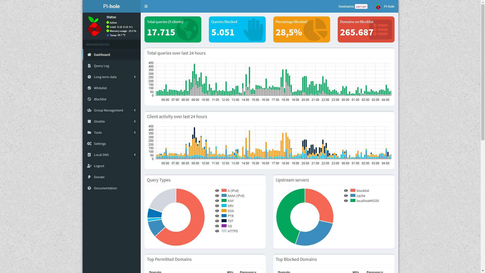

# pihole
Pi-hole lists

Pi-Hole URL: https://pi-hole.net/

Pi-hole blacklist ads based on [bind9 rpz](https://github.com/robi052/bind9-rpz).

Last update: 13/02/2022 @ 03:30

Version 2022021301
Mēris botnet blacklist hosts

Version: 2022012504

Included:
- Fake news portals
- Malware domains
- ads domains

Excluded:
In blacklist file not included Google Analytics and YouTube history. See README-WL file

For using this list just Add this url https://raw.githubusercontent.com/robi052/pihole/master/hosts

  

